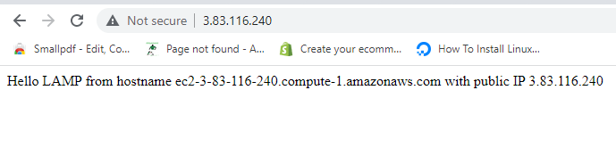

## WEB STACK IMPLEMENTATION (LAMPSTACK) IN AWS

### STEP 1 - INSTALLING APACHE AND UPDATING THE FIREWALL

### STEP 2 - INSTALLING MYSQL

### STEP 3 - INSTALLING PHP

### STEP 4 - CREATING A VIRTUAL HOST FOR YOUR WEBSITE USING APACHE

### STEP 5 - ENABLING VIRTUAL HOST

### STEP 5 CONT'D - TESTING VIRTUAL HOST ON WEBSITE

 

###  STEP 6 - ENABLING PHP ON WEBSITE

 
